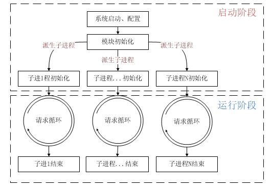
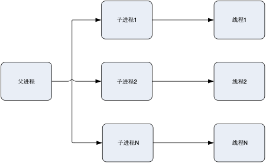
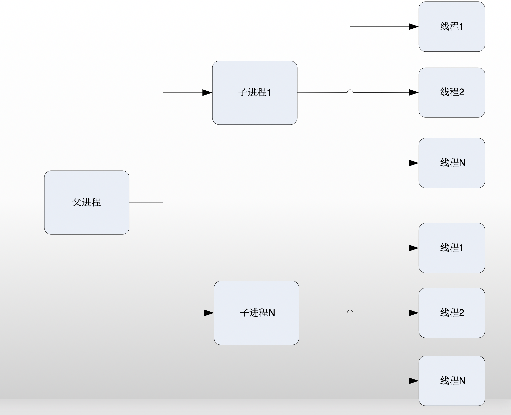
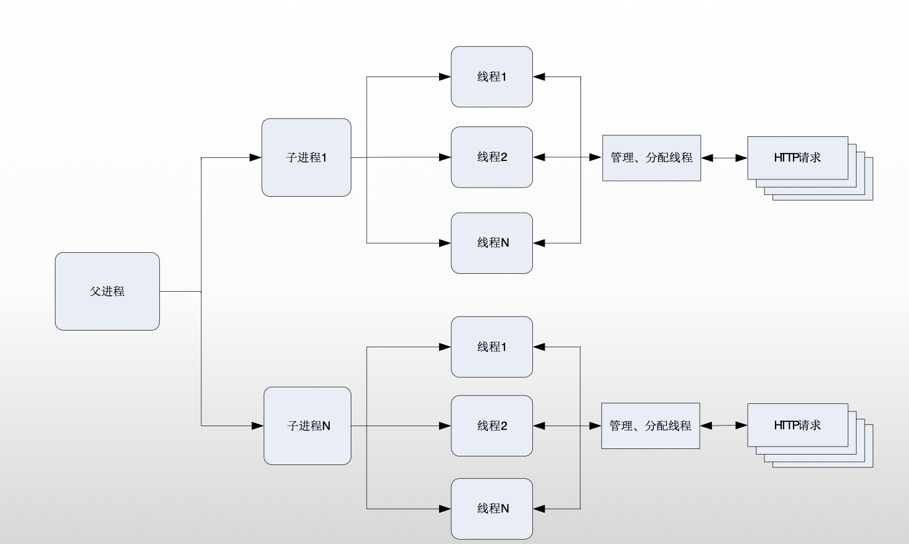

# apache三种工作模式prefork、work、event

<!--more-->
<h1>prefork</h1>
&nbsp;

<strong>关键字：多进程</strong>

prefork模式可以算是很古老但是非常稳定的模式。Apache在启动之初，就预派生 fork一些子进程，然后等待请求进来，并且总是视图保持一些备用的子进程。之所以这样做，是为了减少频繁创建和销毁进程的开销。每个子进程中只有一个线程，在一个时间点内，只能处理一个请求。

在Unix系统中，父进程通常以root身份运行以便邦定80端口，而 Apache产生的子进程通常以一个低特权的用户运行。User和Group指令用于配置子进程的低特权用户。运行子进程的用户必须要对他所服务的内容有读取的权限，但是对服务内容之外的其他资源必须拥有尽可能少的权限。

<strong>优点</strong>：成熟，兼容所有新老模块。进程之间完全独立，使得它非常稳定。同时，不需要担心线程安全的问题。（我们常用的mod_php，PHP的拓展不需要支持线程安全）

<strong>缺点</strong>：一个进程相对占用更多的系统资源，消耗更多的内存。而且，它并不擅长处理高并发请求，在这种场景下，它会将请求放进队列中，一直等到有可用进程，请求才会被处理。

httpd-mpm.conf 中的相关配置：
<pre class="line-numbers" data-start="1"><code class="language-bash">&lt;IfModule mpm_prefork_module&gt;

    #服务器启动时建立的子进程数量
    StartServers          5 

    #空闲子进程的最小数量，默认5；如果当前空闲子进程数少于MinSpareServers ，那么Apache将会产生新的子进程。此参数不要设的太大。
    MinSpareServers       5  

    #空闲子进程的最大数量，默认10；如果当前有超过MaxSpareServers数量的空闲子进程，那么父进程会杀死多余的子进程。此参数也不需要设置太大，如果你将其设置比 MinSpareServers 小，Apache会自动将其修改为MinSpareServers+1。
    MaxSpareServers      10

    #限定服务器同一时间内客户端最大接入的请求数量，默认是150；任何超过了该限制的请求都要进入等待队列，一旦一个个连接被释放，队列中的请求才将得到服务。
    MaxClients          150

    #每个子进程在其生命周期内允许最大的请求数量，如果请求总数已经达到这个数值，子进程将会结束，如果设置为0，子进程将永远不会结束。若该值设置为非0值，可以防止运行PHP导致的内存泄露。
    MaxRequestsPerChild   0
&lt;/IfModule&gt;</code></pre>
&nbsp;

创建的进程数，最多达到每秒32个，直到满足MinSpareServers设置的值为止。这就是预派生（prefork）的由来。这种模式可以不必在请求到来时再产生新的进程，从而减小了系统开销以增加性能。

并发量请求数到达MaxClients（如256）时，而空闲进程只有10个。apache为继续增加创建进程。直到进程数到达256个。

当并发量高峰期过去了，并发请求数可能只有一个时，apache逐渐删除进程，直到进程数到达MaxSpareServers为止。

&nbsp;
<h1><strong>work</strong></h1>
&nbsp;

<strong>关键字：多进程+多线程</strong>

worker模式比起上一个，是使用了多进程+多线程的模式。它也预先fork了几个子进程（数量比较少），每个子进程能够生成一些服务线程和一个监听线程，该监听线程监听接入请求并将其传递给服务线程处理和应答。

Apache总是试图维持一个备用(spare)或是空闲的服务线程池。这样，客户端无须等待新线程或新进程的建立即可得到处理。在Unix中，为了能够绑定80端口，父进程一般都是以root身份启动，随后，Apache以较低权限的用户建立子进程和线程。User和Group指令用于配置Apache子进程的权限。虽然子进程必须对其提供的内容拥有读权限，但应该尽可能给予他较少的特权。另外，除非使用了suexec ，否则，这些指令配置的权限将被CGI脚本所继承。

线程比起进程会更轻量，因为线程通常会共享父进程的内存空间，因此，内存的占用会减少一些，在高并发的场景下，表现得比 prefork模式好。

有些人会觉得奇怪，那么这里为什么不直接使用多线程呢（即在一个进程内实现多进程），还要引入多进程？

原因主要是需要考虑稳定性，如果一个线程异常挂了，会导致父进程连同其他正常的子线程都挂了（它们都是同一个进程下的）。多进程+多线程模式中，各个进程之间都是<strong>独立</strong>的，如果某个线程出现异常，受影响的只是Apache的一部分服务，而不是整个服务。其他进程仍然可以工作。

&nbsp;

<strong>优点：</strong>占据更少的内存，高并发下表现更优秀。

<strong>缺点：</strong>必须考虑线程安全的问题，因为多个子线程是共享父进程的内存地址的。如果使用keep-alive的长连接方式，也许中间几乎没有请求，这时就会发生<strong>阻塞</strong>，线程被挂起，需要一直等待到超时才会被释放。如果过多的线程，被这样占据，也会导致在高并发场景下的无服务线程可用。（该问题在prefork模式下，同样会发生）

Ps：http1.1的keep-alive的长连接方式，是为了让下一次的socket通信复用之前创建的连接，从而，减少连接的创建和销毁的系统开销。保持连接，会让某个进程或者线程一直处于等待状态，即使没有数据过来。

<pre class="line-numbers" data-start="1"><code class="language-bash">&lt;IfModule mpm_worker_module&gt;
    #服务器启动时建立的子进程数量
    StartServers          2

    #限定服务器同一时间内客户端最大接入的请求数量，默认是150；任何超过了该限制的请求都要进入等待队列，一旦一个个连接被释放，队列中的请求才将得到服务。
    MaxClients          150

    #空闲子进程的最小数量
    MinSpareThreads      25

    #空闲子进程的最大数量
    MaxSpareThreads      75 

    #每个子进程产生的线程数量
    ThreadsPerChild      25

    #每个子进程在其生命周期内允许最大的请求数量，如果请求总数已经达到这个数值，子进程将会结束，如果设置为0，子进程将永远不会结束。将该值设置为非0值，可以防止运行PHP导致的内存泄露。
    MaxRequestsPerChild   0
&lt;/IfModule&gt;
</code></pre>
&nbsp;

&nbsp;

理解配置：由主控制进程生成“StartServers”个子进程，每个子进程中包含固定的ThreadsPerChild线程数，各个线程独立地处理请求。同样，为了尽量避免在请求到来才生成线程，MinSpareThreads和MaxSpareThreads设置了最少和最多的空闲线程数；而MaxClients设置了所有子进程中的线程总数。如果现有子进程中的线程总数不能满足负载，控制进程将派生新的子进程。

&nbsp;

&nbsp;
<h1>event</h1>
&nbsp;

关键字：多进程+多线程+epoll

这个是 Apache中最新的模式，在现在版本里的已经是稳定可用的模式。它和 worker模式很像，最大的区别在于，它解决了 keep-alive 场景下 ，长期被占用的线程的资源浪费问题（某些线程因为被keep-alive，挂在那里等待，中间几乎没有请求过来，一直等到超时）。

event MPM中，会有一个专门的线程来管理这些 keep-alive 类型的线程，当有真实请求过来的时候，将请求传递给服务线程，执行完毕后，又允许它释放。这样，一个线程就能处理几个请求了，实现了异步非阻塞。

event MPM在遇到某些不兼容的模块时，会失效，将会回退到worker模式，一个工作线程处理一个请求。官方自带的模块，全部是支持event MPM的。

&nbsp;

&nbsp;

注意一点，event MPM需要Linux系统（Linux 2.6+）对Epoll的支持，才能启用。

还有，需要补充的是HTTPS的连接（SSL），它的运行模式仍然是类似worker的方式，线程会被一直占用，知道连接关闭。部分比

较老的资料里，说event MPM不支持SSL，那个说法是几年前的说法，现在已经支持了。

<pre class="line-numbers" data-start="1"><code class="language-bash">&lt;IfModule mpm_worker_module&gt;
    #服务器启动时建立的子进程数量
    StartServers             3

    #空闲子进程的最小数量
    MinSpareThreads         75

    #空闲子进程的最小数量
    MaxSpareThreads        250

    #每个子进程产生的线程数量
    ThreadsPerChild         25

    #限定服务器同一时间内客户端最大接入的请求数量，默认是150；任何超过了该限制的请求都要进入等待队列，一旦一个个连接被释放，队列中的请求才将得到服务。
    MaxRequestWorkers      400

    #每个子进程在其生命周期内允许最大的请求数量，如果请求总数已经达到这个数值，子进程将会结束，如果设置为0，子进程将永远不会结束。将该值设置为非0值，可以防止运行PHP导致的内存泄露。
    MaxRequestsPerChild   0
&lt;/IfModule&gt;</code></pre>
&nbsp;

本文转自：<a href="http://blog.csdn.net/STFPHP/article/details/52954303" target="_blank" rel="noopener">http://blog.csdn.net/STFPHP/article/details/52954303 </a>

&nbsp;

---

> 作者: [SoulChild](https://www.soulchild.cn)  
> URL: https://www.soulchild.cn/post/949/  

