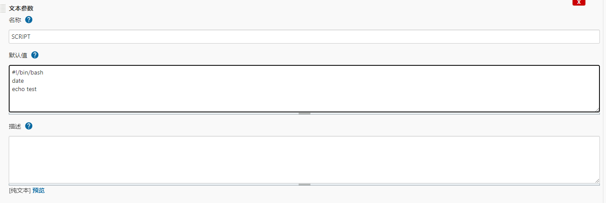

# Jenkins文本参数无法获取换行问题

<!--more-->

在使用jenkins参数化构建的文本参数时, 如果内容包含换行, 比如

使用`echo "$SCRIPT"`输出内容会发现结果是: `#!/bin/bash date echo test`

使用`printf`可以解决这个问题: `printf "$SCRIPT"`

---

> 作者: [SoulChild](https://www.soulchild.cn)  
> URL: https://www.soulchild.cn/post/jenkins%E6%96%87%E6%9C%AC%E5%8F%82%E6%95%B0%E6%97%A0%E6%B3%95%E8%8E%B7%E5%8F%96%E6%8D%A2%E8%A1%8C%E9%97%AE%E9%A2%98/  

