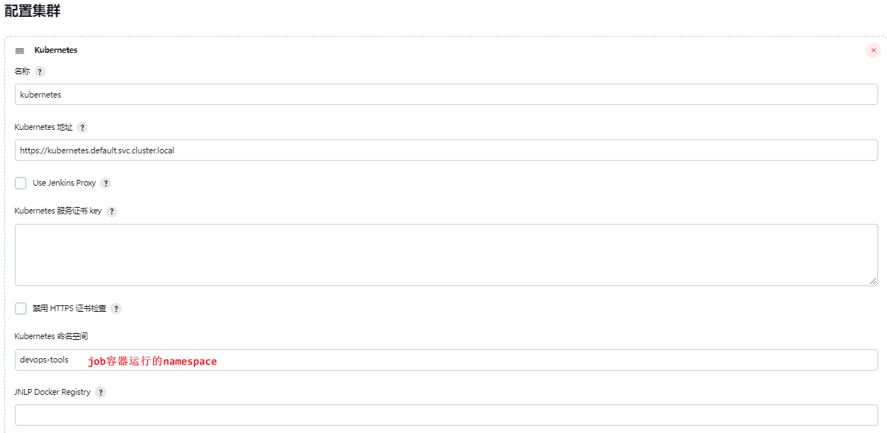
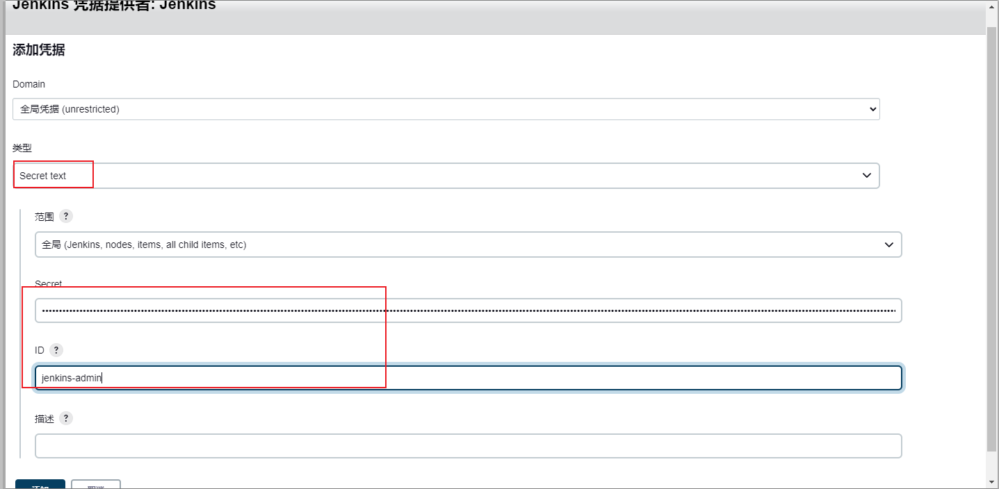
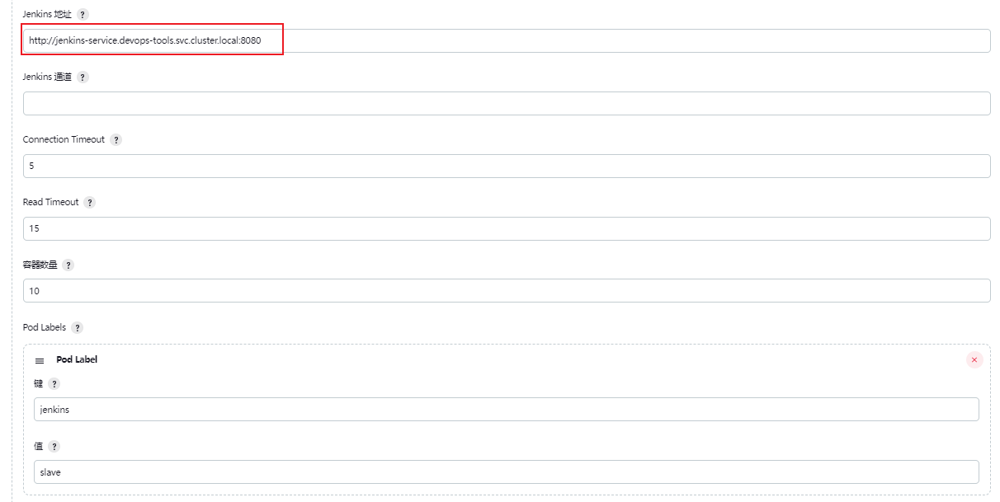
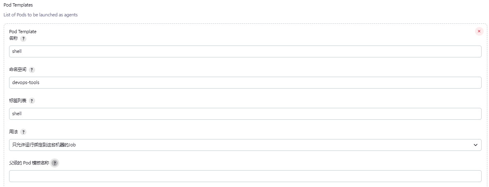
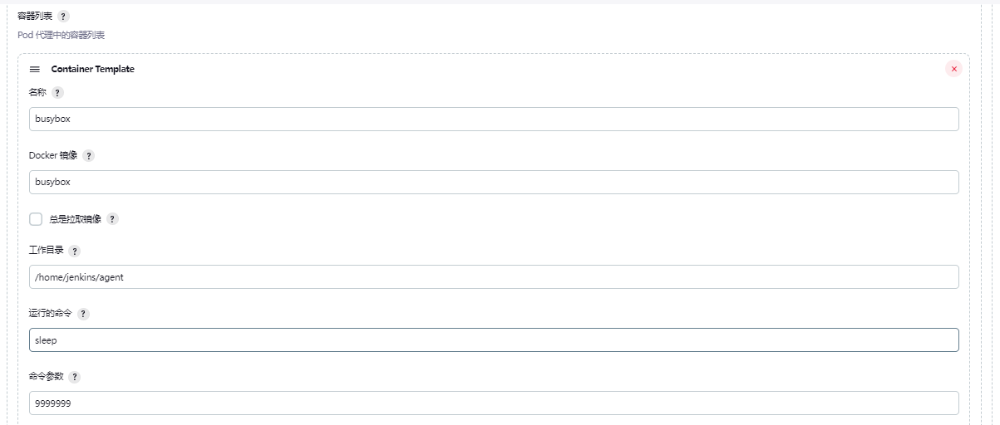
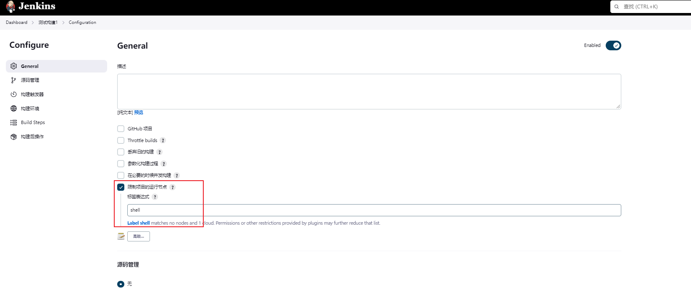

# K8s部署jenkins


<!--more-->

### 1. 创建namespace
```bash
kubectl create namespace devops-tools
```


### 2. 创建账号权限相关
```bash
cat <<EOF | kubectl apply -f -
---
apiVersion: rbac.authorization.k8s.io/v1
kind: ClusterRole
metadata:
  name: jenkins-admin
rules:
  - apiGroups: [""]
    resources: ["*"]
    verbs: ["*"]
---
apiVersion: v1
kind: ServiceAccount
metadata:
  name: jenkins-admin
  namespace: devops-tools
---
apiVersion: rbac.authorization.k8s.io/v1
kind: ClusterRoleBinding
metadata:
  name: jenkins-admin
roleRef:
  apiGroup: rbac.authorization.k8s.io
  kind: ClusterRole
  name: jenkins-admin
subjects:
- kind: ServiceAccount
  name: jenkins-admin
  namespace: devops-tools
---
apiVersion: v1
kind: Secret
metadata:
  name: jenkins-admin
  namespace: devops-tools
  annotations:
    kubernetes.io/service-account.name: "jenkins-admin"
type: kubernetes.io/service-account-token
EOF
```


### 3. 配置存储
```bash
cat <<EOF | kubectl apply -f -
apiVersion: v1
kind: PersistentVolumeClaim
metadata:
  name: jenkins-pv-claim
  namespace: devops-tools
spec:
  storageClassName: nfs
  accessModes:
    - ReadWriteOnce
  resources:
    requests:
      storage: 3Gi
EOF
```


### 4.创建Deployment
```bash
cat <<EOF | kubectl apply -f -
apiVersion: apps/v1
kind: Deployment
metadata:
  name: jenkins
  namespace: devops-tools
spec:
  replicas: 1
  selector:
    matchLabels:
      app: jenkins-server
  template:
    metadata:
      labels:
        app: jenkins-server
    spec:
      securityContext:
        fsGroup: 1000
        runAsUser: 1000
      serviceAccountName: jenkins-admin
      containers:
        - name: jenkins
          image: jenkins/jenkins:lts
          resources:
            limits:
              memory: "2Gi"
              cpu: "1000m"
            requests:
              memory: "500Mi"
              cpu: "500m"
          ports:
            - name: httpport
              containerPort: 8080
            - name: jnlpport
              containerPort: 50000
          livenessProbe:
            httpGet:
              path: "/login"
              port: 8080
            initialDelaySeconds: 90
            periodSeconds: 10
            timeoutSeconds: 5
            failureThreshold: 5
          readinessProbe:
            httpGet:
              path: "/login"
              port: 8080
            initialDelaySeconds: 60
            periodSeconds: 10
            timeoutSeconds: 5
            failureThreshold: 3
          volumeMounts:
            - name: jenkins-data
              mountPath: /var/jenkins_home
      volumes:
        - name: jenkins-data
          persistentVolumeClaim:
              claimName: jenkins-pv-claim
EOF
```

### 5. 暴露服务
```bash
cat <<EOF | kubectl apply -f -
---
apiVersion: v1
kind: Service
metadata:
  name: jenkins-service
  namespace: devops-tools
  annotations:
      prometheus.io/scrape: 'true'
      prometheus.io/path:   /prometheus
      prometheus.io/port:   '8080'
spec:
  selector:
    app: jenkins-server
  type: ClusterIP
  ports:
    - port: 8080
      name: web
      targetPort: 8080
    - port: 50000
      name: jnlp
      targetPort: 50000
---
apiVersion: networking.k8s.io/v1
kind: Ingress
metadata:
  name: jenkins.ops.cn
  namespace: devops-tools
spec:
  ingressClassName: int-nginx
  rules:
  - host: jenkins.ops.cn
    http:
      paths:
      - backend:
          service:
            name: jenkins-service
            port:
              number: 8080
        path: /
        pathType: Prefix
EOF
```
> service忘记暴露50000端口，在使用agent时会发生java.io.IOException: http://jenkins-service.devops-tools.svc.cluster.local:8080/ provided port:50000 is not reachable on host jenkins-service.devops-tools.svc.cluster.local

### 6. 查看密码
```bash
kubectl exec -it -n devops-tools jenkins-5498fbb866-twvxq -- cat /var/jenkins_home/secrets/initialAdminPassword 
```

### 7. 配置agent
需要提前装好kubernetes 插件

#### 7.1 配置k8s集群信息



#### 7.2 添加连接到k8s的凭据






#### 7.3 Pod模板配置





### 8. 测试构建



---

> 作者: [SoulChild](https://www.soulchild.cn)  
> URL: https://www.soulchild.cn/post/k8s%E9%83%A8%E7%BD%B2jenkins/  

