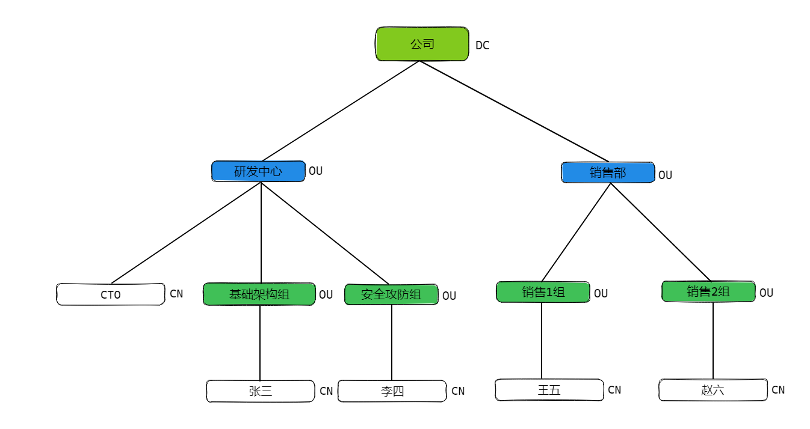
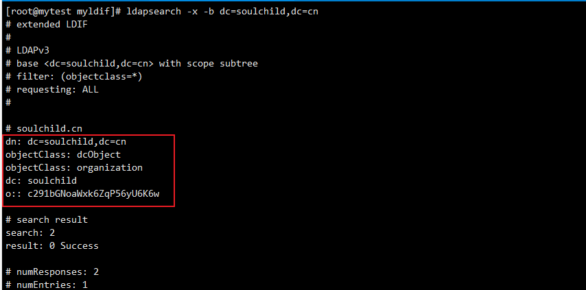

# Openldap2.44安装和配置详解(一)


<!--more-->

## 参考
https://www.golinuxcloud.com/ldap-tutorial-for-beginners-configure-linux/

https://www.golinuxcloud.com/install-and-configure-openldap-centos-7-linux/

https://access.redhat.com/documentation/en-us/red_hat_enterprise_linux/7/html/system-level_authentication_guide/openldap

## 常见术语
- Entry or object(条目或对象) - LDAP中的基本单元。每个条目都由专有名称 (DN) 限定。这是一个例子：`dn: uid=yyang,ou=sales,dc=example,dc=com`
- Attributes - 属性是与条目关联的信息，例如组织有地址属性或员工有电话号码属性。
- objectClass - 这是一种特殊类型的属性。LDAP 中的所有对象都必须有一个objectClass属性。该objectClass定义指定每个 LDAP 对象需要哪些属性，并指定条目的对象类。此属性的值可以由客户端修改，但objectClass不能删除属性本身。
  - objectClass是定义在schema文件中的
- Schema - 列出了每个对象类型的属性，以及这些属性是必需的还是可选的。下面是一些schema示例,可以在`/etc/openldap/schema/`中找到。
  - core.schema - 定义基本的 LDAPv3 属性和对象。它是 OpenLDAP 实现中必需的核心schema。
  - inetorgperson.schema - 定义 inetOrgPerson 对象类及其相关属性。该对象通常用于存储人们的联系信息。
- LDIF - 它是 LDAP 数据交换格式。用于向 LDAP 服务器导入或导出数据的文件应采用这种格式。用于在 LDAP 服务器之间进行复制的数据也是这种格式。

- 服务器端由两个主要守护进程组成：
  - slapd：这是一个独立的 LDAP 守护进程，它侦听来自客户端的 LDAP 连接并响应它通过这些连接接收到的 LDAP 操作。
  - slurpd：这是一个独立的 LDAP replication 守护进程，用于将更改从一个 slapd 数据库传播到另一个数据库。只有在使用多个 LDAP 服务器时才需要它。


## 一、安装openldap
```bash
[root@mytest]# yum install -y openldap openldap-servers openldap-clients openldap-devel compat-openldap
```
> openldap-devel compat-openldap可选

## 二、基本配置
老版本中 `/etc/openldap/slapd.d/slapd.conf` 保存了 OpenLDAP 服务器的配置。但现在配置保存在 LDAP 数据库本身中。所以后续使用ldif的方式来操作数据


### 1. 修改默认配置
默认配置在`/etc/openldap/slapd.d/cn\=config/olcDatabase\=\{2\}hdb.ldif`文件中查看。
也可以使用命令`ldapsearch -Y EXTERNAL -H ldapi:/// -b cn=config olcDatabase=\*`。

我们新建一个ldif文件配合`ldapmodify`命令完成对他的修改
```bash
[root@mytest myldif]# cat >> my_config.ldif <<EOF
dn: olcDatabase={2}hdb,cn=config
changetype: modify
replace: olcSuffix
olcSuffix: dc=soulchild,dc=cn

dn: olcDatabase={2}hdb,cn=config
changetype: modify
replace: olcRootDN
olcRootDN: cn=admin,dc=soulchild,dc=cn
EOF
```
> dn代表唯一标识，我们用它来确定修改哪个数据库 
>
> changetype代表修改操作
> 
> replace代表替换某个条目
> 
> olcSuffix: xxx 是修改后的值


执行ldapmodify修改
```bash
[root@mytest myldif]# ldapmodify -Y EXTERNAL -H ldapi:/// -f my_config.ldif
SASL/EXTERNAL authentication started
SASL username: gidNumber=0+uidNumber=0,cn=peercred,cn=external,cn=auth
SASL SSF: 0
modifying entry "olcDatabase={2}hdb,cn=config"

modifying entry "olcDatabase={2}hdb,cn=config"
```

### 2. 设置管理员密码
```bash
[root@mytest myldif]# slappasswd
New password:
Re-enter new password:
{SSHA}sBE7mBD5dfzk/wpQVBjUQMHOD74BegDd


[root@mytest myldif]# cat >> adminPass.ldif <<EOF
dn: olcDatabase={2}hdb,cn=config
changeType: modify
add: olcRootPW
olcRootPW: {SSHA}sBE7mBD5dfzk/wpQVBjUQMHOD74BegDd
EOF


[root@mytest myldif]# ldapmodify -Y EXTERNAL -H ldapi:/// -f adminPass.ldif
SASL/EXTERNAL authentication started
SASL username: gidNumber=0+uidNumber=0,cn=peercred,cn=external,cn=auth
SASL SSF: 0
modifying entry "olcDatabase={2}hdb,cn=config"
```

### 3. 允许管理员访问
```bash
[root@mytest myldif]# cat >> adminAccess.ldif <<EOF
dn: olcDatabase={1}monitor,cn=config
changetype: modify
replace: olcAccess
olcAccess: {0}to * by dn.base="gidNumber=0+uidNumber=0,cn=peercred,cn=external, cn=auth" read by dn.base="cn=admin,dc=soulchild,dc=cn" read by * none
EOF


[root@mytest myldif]# ldapmodify -Y EXTERNAL -H ldapi:/// -f adminAccess.ldif
SASL/EXTERNAL authentication started
SASL username: gidNumber=0+uidNumber=0,cn=peercred,cn=external,cn=auth
SASL SSF: 0
modifying entry "olcDatabase={1}monitor,cn=config"
```

### 4. 加载默认schema

```bash
# 配置
cat > schema.ldif <<EOF
dn: cn=schema,cn=config
objectClass: olcSchemaConfig
cn: schema

include: file:///etc/openldap/schema/collective.ldif
include: file:///etc/openldap/schema/corba.ldif
include: file:///etc/openldap/schema/cosine.ldif
include: file:///etc/openldap/schema/duaconf.ldif
include: file:///etc/openldap/schema/dyngroup.ldif
include: file:///etc/openldap/schema/inetorgperson.ldif
include: file:///etc/openldap/schema/java.ldif
include: file:///etc/openldap/schema/misc.ldif
include: file:///etc/openldap/schema/nis.ldif
include: file:///etc/openldap/schema/openldap.ldif
include: file:///etc/openldap/schema/pmi.ldif
include: file:///etc/openldap/schema/ppolicy.ldif
EOF

# 添加
[root@mytest myldif]# ldapadd -Y EXTERNAL -H ldapi:/// -f schema.ldif 
SASL/EXTERNAL authentication started
SASL username: gidNumber=0+uidNumber=0,cn=peercred,cn=external,cn=auth
SASL SSF: 0
adding new entry "cn=schema,cn=config"
adding new entry "cn=collective,cn=schema,cn=config"
......

# 查询
[root@mytest myldif]# ldapsearch -Y EXTERNAL -H ldapi:/// -b cn=schema,cn=config dn
```

### 5. 禁止匿名搜索
```bash
[root@mytest myldif]# cat > disableAnon.ldif << EOF
dn: cn=config
changetype: modify
add: olcDisallows
olcDisallows: bind_anon

dn: cn=config
changetype: modify
add: olcRequires
olcRequires: authc

dn: olcDatabase={-1}frontend,cn=config
changetype: modify
add: olcRequires
olcRequires: authc
EOF

[root@mytest myldif]# ldapmodify -Y EXTERNAL -H ldapi:/// -f disableAnon.ldif
```

### 6. 开启日志
```bash
# 日志级别请参考https://www.openldap.org/doc/admin24/slapdconf2.html中5.2.1.2部分介绍
[root@mytest myldif]# cat > setLogLevel.ldif << EOF
dn: cn=config
changetype: modify
replace: olcLogLevel
olcLogLevel: stats
EOF

[root@mytest myldif]# ldapmodify -Y EXTERNAL -H ldapi:/// -f setLogLevel.ldif


# openldap将日志输出到syslog的local4中, 还需要修改一个rsyslog的配置
echo 'local4.* /var/log/slapd.log' >> /etc/rsyslog.d/slapd.conf

```

## 三、创建根目录 DC
在创建之前在理解一下dc、ou、cn



准备ldif
```bash
[root@mytest myldif]# cat > rootObj.ldif <<EOF
dn: dc=soulchild,dc=cn
objectClass: dcObject
objectClass: organization
dc: soulchild
o: soulchild随笔记
EOF
```
> dcObject 和 organization 表示该目录是一个域目录（dcObject）和一个组织（organization）。
> 
> dcObject包含必填属性dc。organization包含必填属性o。
> 
> dc 表示目录的名称。
> o 表示组织全称。
> 例如: dc是alibaba，o是阿里巴巴集团控股有限公司

创建
```bash
ldapadd -f rootObj.ldif -D cn=admin,dc=soulchild,dc=cn -W  # -w 指定密码 -W 交互式输入密码

# 也可以使用本地套接字的方式，可以免密码
# ldapadd -Y EXTERNAL -H ldapi:/// -f rootObj.ldif
```

查看
```bash
ldapsearch -x -b dc=soulchild,dc=cn
```




## 四、创建组织单元 OU
创建研发中心
```bash
[root@mytest myldif]# cat > 研发中心.ldif <<EOF
dn: ou=研发中心,dc=soulchild,dc=cn
objectClass: organizationalUnit
ou: 研发中心
EOF


[root@mytest myldif]# ldapadd -f 研发中心.ldif -D cn=admin,dc=soulchild,dc=cn -W
```

创建基础架构组
```bash
[root@mytest myldif]# cat > 研发中心.基础架构组.ldif <<EOF
dn: ou=基础架构组,ou=研发中心,dc=soulchild,dc=cn
objectClass: organizationalUnit
ou: 基础架构组
EOF


[root@mytest myldif]# ldapadd -f 研发中心.基础架构组.ldif -D cn=admin,dc=soulchild,dc=cn -W
```

## 五、创建用户

CTO用户
```bash
# cn表示名，sn表示姓，uid一般是登录用的, 这里使用的cn作为rdn(rdn是dn最前面那一个cn=cto)
[root@mytest myldif]# cat > 研发中心.cto.ldif <<EOF
dn: cn=cto,ou=研发中心,dc=soulchild,dc=cn
cn: cto
sn: cto
objectClass: inetOrgPerson
userPassword: 123456
uid: cto
EOF

[root@mytest myldif]# ldapadd -f 研发中心.cto.ldif -x -D cn=admin,dc=soulchild,dc=cn -W
```

基础架构组用户
```bash
# cn表示名, sn表示姓, 这里使用的cn作为rdn(rdn是dn最前面那一个cn=cto)
[root@mytest myldif]# cat > 研发中心.基础架构组.张三.ldif <<EOF
dn: cn=张三,ou=基础架构组,ou=研发中心,dc=soulchild,dc=cn
cn: 张三
sn: zhangsan
objectClass: inetOrgPerson
userPassword: 123
EOF

[root@mytest myldif]# ldapadd -f 研发中心.基础架构组.张三.ldif -x -D cn=admin,dc=soulchild,dc=cn -W
```

## 六、创建组

创建一个jenkins组, 添加多个成员到这个组
```bash
[root@mytest myldif]# cat > 研发中心.jenkins.ldif <<EOF
dn: cn=jenkins,ou=研发中心,dc=soulchild,dc=cn
cn: jenkins
objectClass: groupOfNames
member: cn=cto,ou=研发中心,dc=soulchild,dc=cn
member: cn=张三,ou=基础架构组,ou=研发中心,dc=soulchild,dc=cn
EOF

[root@mytest myldif]# ldapadd -f 研发中心.jenkins.ldif -x -D cn=admin,dc=soulchild,dc=cn -W
```
> 这个组无法配合jenkins实现组下用户登录，没研究出来


## 七、删除条目或对象

删除操作比较简单，直接指定dn就可以了
```bash
[root@mytest myldif]# ldapdelete "cn=jenkins,ou=研发中心,dc=soulchild,dc=cn" -D cn=admin,dc=soulchild,dc=cn -W
```


---

> 作者: [SoulChild](https://www.soulchild.cn)  
> URL: https://www.soulchild.cn/post/openldap2.44%E5%AE%89%E8%A3%85%E5%92%8C%E9%85%8D%E7%BD%AE%E8%AF%A6%E8%A7%A3%E4%B8%80/  

