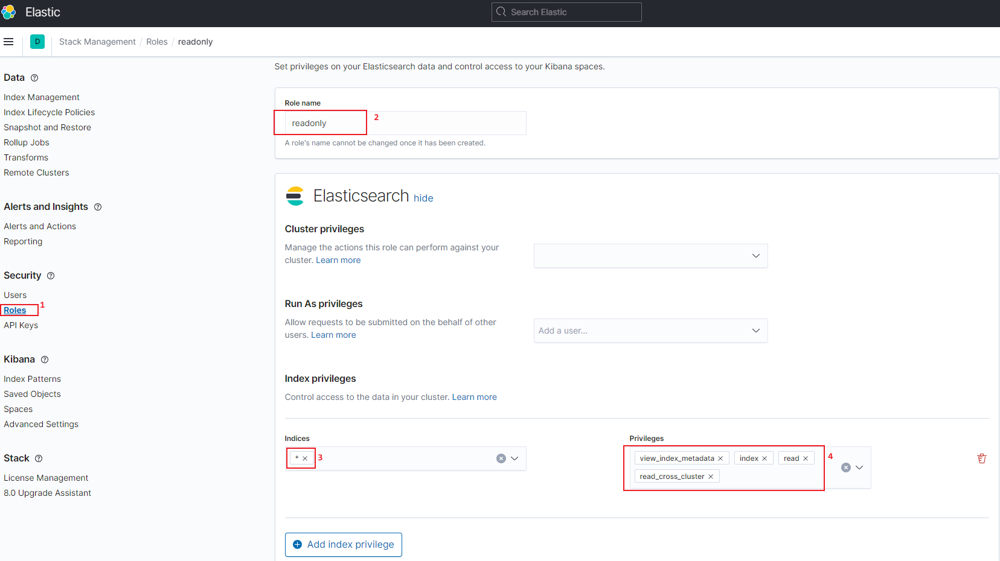
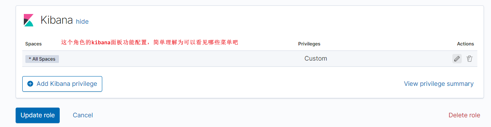
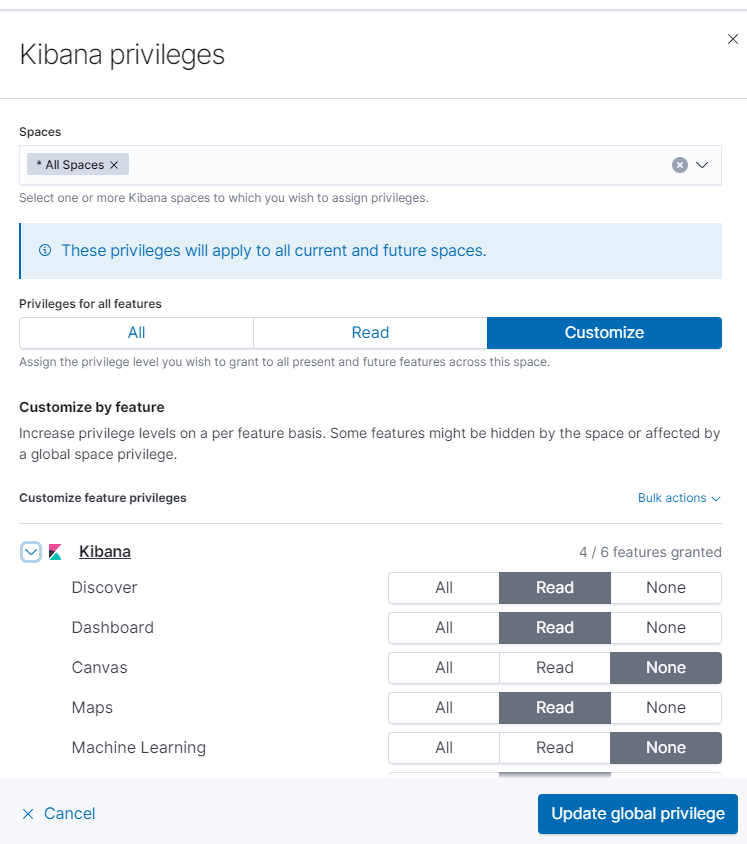
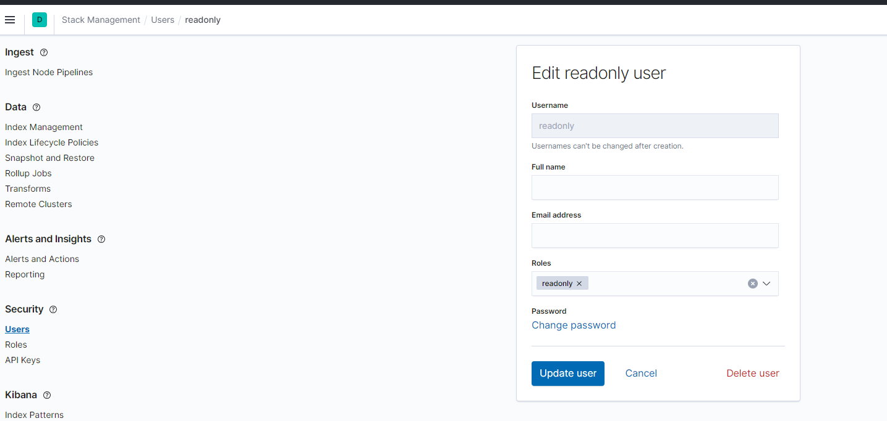

# 使用kibana创建es只读用户

<!--more-->

### 1. 创建角色

kibana面板权限配置，根据自己需求配置即可

### 2. 创建用户

---

> 作者: [SoulChild](https://www.soulchild.cn)  
> URL: https://www.soulchild.cn/post/%E4%BD%BF%E7%94%A8kibana%E5%88%9B%E5%BB%BAes%E5%8F%AA%E8%AF%BB%E7%94%A8%E6%88%B7/  

