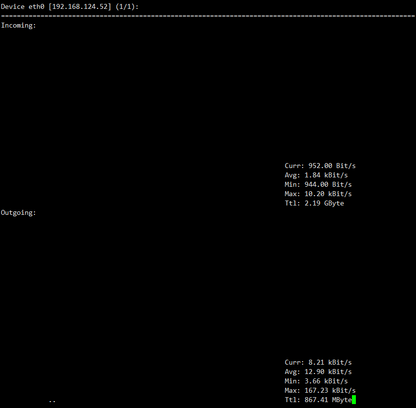
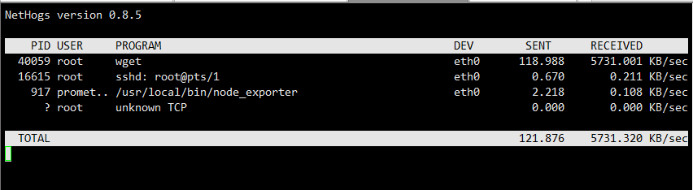
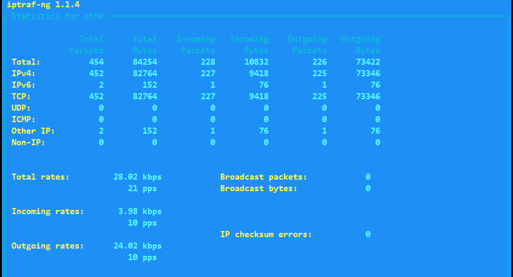

# 常用网络带宽测试工具


<!--more-->

除了iftop外还有一些查看网络带宽的工具很好用，记录一下防止忘记

### 1. nload
```bash
yum install -y nload
nload eth0
```


### 2.nethogs
可以显示进程的pid
```bash
yum install nethogs 
nethogs eth0
```


### 3.iptraf 
```bash
yum install -y iptraf
iptraf-ng -d eth0
```


---

> 作者: [SoulChild](https://www.soulchild.cn)  
> URL: https://www.soulchild.cn/post/%E5%B8%B8%E7%94%A8%E7%BD%91%E7%BB%9C%E5%B8%A6%E5%AE%BD%E6%B5%8B%E8%AF%95%E5%B7%A5%E5%85%B7/  

